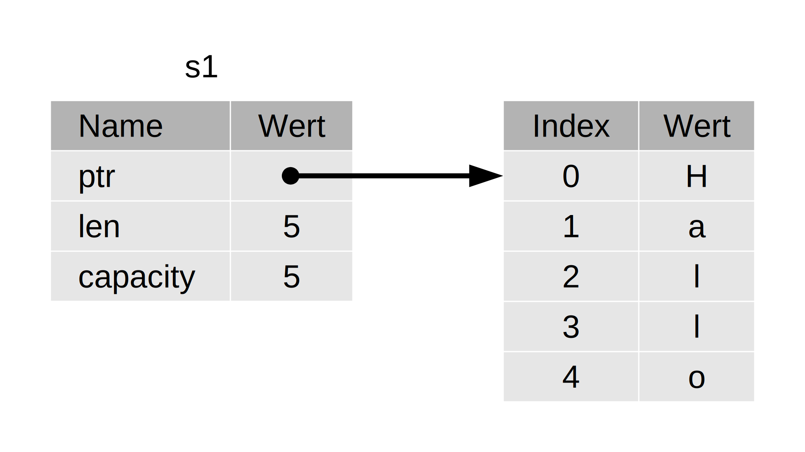

# wkdbook: Rust

## Ein Projekt erstellen

- Projektverzeichnis mit Cargo erstellen: `cargo new projektname`
- Dies erstellt einen `src`-Ordner mit der main.rs Datei (inkl. Hello World Template) und einen `target`-Ordner mit einem Git-Repository und der zugehörigen `.gitignore`-Datei sowie einer `Cargo.toml`-Datei, welche die Cargo-Konfigurationsdatei darstellt. Eine `Cargo.lock`-Datei wird auch erstellt, diese sollte jedoch vom Developer i.d.R. nicht Bearbeitet werden. Darin werden die Versionsnummern der Abhängigkeiten deines ersten erfolgreichen Builds gespeichert. Damit erspart sich Cargo das erneute checken von Versionsnummern und als Developer erhält man auch in Zukunft sicher einen Build mit funktionierenden Versionen der Abhängigkeiten. Erst wenn man in der der inder `Cargo.toml` manuell Versionsnummern ändert, aktualisiert sich auch die `Cargo.lock`
- Mit dem Befehl `cargo build` kann man das Projekt builden und eine ausführbare Binary-Datei erstellen
- Der Befehl `cargo run` fasst das builden sowie executen der Binary in einem Befehl zusammen
- `cargo check` überprüft schnell deinen Code, um sicherzustellen, dass er kompiliert, erzeugt aber keine ausführbare Datei

***

## Wichtige Cargo / Crates, Bibliotheken, Module, Funktionen & Makros

### Cargo / Crates
- [Cargo](https://doc.rust-lang.org/cargo/) ist das Bau-System (build system) und der Paketmanager von Rust. Die meisten Rust-Entwickler verwenden dieses Werkzeug, um ihre Rust-Projekte zu verwalten, weil Cargo viele Aufgaben für dich erledigt, z.B. Bauen deines Codes, Herunterladen der Bibliotheken, von denen dein Code abhängt, und das Bauen dieser Bibliotheken. (Wir nennen Bibliotheken, die dein Code benötigt, Abhängigkeiten (dependencies))
- Ein Crate (dt.: Kiste) ist eine Sammlung von Rust-Quellcode-Dateien und werden von Rust-Developer typischerweise mit Cargo auf [crates.io](crates.io) hochgeladen
- Ein Projekt kann entweder als "binary crate" oder ["library crate"](https://doc.rust-lang.org/rust-by-example/crates/lib.html) angelegt werden. Ersteres können ausgeführt werden, zweiteres können ausschließlich in anderen Projekten eingebunden, aber eben nicht selbstständig ausgeführt werden
- Möchte man eine "library crate" einbinden muss man dies in der `Cargo.toml` unter `[dependencies]` deklarien, zb.: `rand = "0.8.3"`
- Mit `cargo update` überschreibt Cargo die Versionsnummer ind `Cargo.toml` & `Cargo.lock` mit den aktuellsten Versionen der Abhängigkeiten
- In der Datei Cargo.toml ist alles, was nach einer Überschrift folgt, Teil dieses Abschnitts, der so lange andauert, bis ein anderer Abschnitt beginnt. Im Abschnitt `[dependencies]` teilst du Cargo mit, von welchen externen Kisten dein Projekt abhängt und welche Versionen dieser Kisten du benötigst
- Wenn wir eine externe Abhängigkeit einfügen, holt Cargo die neuesten Versionen von allem was die Abhängigkeit benötigt. Möglicherweiße lädt Cargo daher auch andere Pakete/Bibliotheken, von dem die hinzugefügte Abhängigkeit selbst abhängt
- Eine weitere nette Funktionalität von Cargo ist, dass das Ausführen des Kommandos `cargo doc --open` die von all deinen Abhängigkeiten bereitgestellte Dokumentation lokal zusammenstellt und in deinem Browser öffnet

### Bibliotheken
- Standardmäßig hat Rust einige Elemente in der Standardbibliothek definiert, die es in den Gültigkeitsbereich jedes Programms bringt. Diese Menge wird Präludium genannt, und du kannst deren Inhalt in der [Dokumentation der Standardbibliothek](https://doc.rust-lang.org/std/prelude/index.html) sehen
- Wenn ein Typ, den du verwenden willst, nicht im Präludium enthalten ist, musst du diesen Typ explizit mit einer use-Anweisung in den Gültigkeitsbereich bringen. Das Verwenden der Bibliothek std::io bietet dir eine Reihe von nützlichen Funktionalitäten, einschließlich der Möglichkeit, Benutzereingaben entgegenzunehmen
- Biblitotheken und Module werden mit `use ...` eingebunden
- `io::stdin()` ruft die Funktion `stdin` aus dem Modul `io` auf 
- Bibliotheken wie zb.: `io` müssen nicht am Anfang des Programms importiert werden, sondern man könnte die Funktion trotzdem verwenden, indem man den Funktionsaufruf als [`std::io::stdin`](https://doc.rust-lang.org/std/io/struct.Stdin.html) schreibt. Die Funktion `stdin` gibt eine Instanz von `std::io::Stdin` zurück, was ein Typ ist, der eine Standardeingaberessource (handle to the standard input) für dein Terminal darstellt

### Wichtige Crates

- [rand](https://crates.io/crates/rand) um zufällige Zahlen zu generieren

### Wichtige Module

- `std:io` => Ein-/Ausgabefunktionalität 
- `std::cmp::Ordering` => Vergleichen und Ordnen von Werten

### Wichtige Funktionen, Methoden & Makros 

#### println!
- [`println!`](https://doc.rust-lang.org/std/macro.println.html) gibt eine Zeichenkette auf dem Bildschirm aus, zb.: `println!("Rate die Zahl!");`
- Mehrere Werte in `println` ausgeben: `println!("x = {} und y = {}", x, y);`
- Das Makro `println!` kann diverse Formatierungen vornehmen. Die geschweiften Klammern weisen `println!` an, die Formatierung `Display` zu verwenden, bei der die Ausgabe direkt für den Endbenutzer bestimmt ist. Primitiven Typen implementieren Display standardmäßig, denn es gibt nur eine Möglichkeit, dem Benutzer eine `1` oder einen anderen primitiven Typ zu zeigen. Aber bei Strukturen `struct` ist die Formatierung, die `println!` verwenden soll, weniger klar, da es mehrere Darstellungsmöglichkeiten gibt: Möchte man Kommas oder nicht? Möchte man die geschweiften Klammern ausgeben? Sollen alle Felder angezeigt werden? Aufgrund der vielen Möglichkeiten versucht Rust nicht zu erraten, was man will. Strukturen haben daher keine Standardimplementierung von `Display`, um die mit `println!` und dem Platzhalter `{}` verwenden zu können. Der Compiler wweißt mit `std::fmt::Display is not implemented for...` genau auf diesen Fehler hin.
- Der Makroaufruf `println!` kann dann in zb.: `println!("rect1 ist {:?}", rect1);` geändert werden. Wenn man das Symbol `:?` innerhalb der geschweiften Klammern angibt, teilt man `println!` mit, dass man das Ausgabeformat `Debug` verwenden möchte. Das Merkmal (trait) `Debug` ermöglicht es, die Struktur so auszugeben, dass Entwickler ihren Wert erkennen können, während sie den Code debuggen. Wichtig: Weiters muss auch noch `#[derive(Debug)]` direkt vor der `struct`-Definition eingefügt werden.  Bei größeren Strukturen ist es hilfreich, eine leichter lesbare Ausgabe zu erhalten. In diesen Fällen können wir {:#?} anstelle von {:?} in der println!-Meldung verwenden. 
  
#### [dbg!](https://doc.rust-lang.org/std/macro.dbg.html)
Eine andere Möglichkeit, einen Wert im Debug-Format auszugeben, ist die Verwendung des Makros `dbg!`, das die Eigentümerschaft eines Ausdrucks übernimmt (im Gegensatz zu `println!`, das eine Referenz nimmt), die Datei und Zeilennummer, in der der `dbg!`-Makroaufruf in deinem Code vorkommt, zusammen mit dem resultierenden Wert des Ausdrucks ausgibt und die Eigentümerschaft am Wert zurückgibt.

- Der Aufruf des Makros `dbg!` schreibt in den Standard-Fehler-Konsolenstrom (`stderr`), im Gegensatz zu `println!`, das in den Standard-Ausgabe-Konsolenstrom (`stdout`) schreibt.

                #[derive(Debug)]
                struct Rectangle {
                width: u32,
                height: u32,
                }

                fn main() {
                let scale = 2;
                let rect1 = Rectangle {
                        width: dbg!(30 * scale),
                        height: 50,
                };

                dbg!(&rect1);
                }

Man kann `dbg!` zb.: um den Ausdruck `30 * scale` setzen, und da `dbg!` die Eigentümerschaft des Werts des Ausdrucks zurückgibt, erhält das Feld width denselben Wert, als wenn wir den `dbg!`-Aufruf dort nicht hätten. Wir wollen nicht, dass dbg! die Eigentümerschaft von `rect1` übernimmt, also übergeben wir eine Referenz auf `rect1` im nächsten Aufruf. So sieht die Ausgabe dieses Beispiels aus:

                $ cargo run
                Compiling rectangles v0.1.0 (file:///projects/rectangles)
                Finished dev [unoptimized + debuginfo] target(s) in 0.61s
                Running `target/debug/rectangles`
                [src/main.rs:10] 30 * scale = 60
                [src/main.rs:14] &rect1 = Rectangle {
                width: 60,
                height: 50,
                }

Man kann sehen, dass der erste Teil der Ausgabe von src/main.rs Zeile 10 stammt, wo der Ausdruck `30 * scale` debugged wird, und der resultierende Wert `60` ist (die Debug-Formatierung, die für Ganzzahlen implementiert ist, gibt nur deren Wert aus). Der `dbg!`-Aufruf in Zeile 14 von src/main.rs gibt den Wert von `&rect1` aus, der die Struktur `Rectangle` ist.

#### read_line
- [`read_line`](https://doc.rust-lang.org/std/io/struct.Stdin.html#method.read_line) ermöglicht es eine Benutzereingabe zu verarbeiten, zb.: `io::stdin().read_line(&mut guess)`. Das Zeichenketten-Argument muss veränderlich (`mut` bzw. `&mut`, um die Referenz `&` veränderlich zu machen) sein, damit die Methode den Inhalt der Zeichenkette ändern kann

#### parse()
- [`parse()`](https://doc.rust-lang.org/std/primitive.str.html#method.parse)-Methode für Strings  konvertiert eine Zeichenkette in einen anderen Typ. Die Methode parse funktioniert nur bei Zeichen, die logisch in Zahlen umgewandelt werden können. Wenn die Zeichenkette zum Beispiel A👍% enthielte, gäbe es keine Möglichkeit, dies in eine Zahl umzuwandeln. Da dies fehlschlagen könnte, gibt die parse-Methode einen Result-Typ zurück

#### match()
- [match](https://rust-lang-de.github.io/rustbook-de/ch06-02-match.html): Gleicht einen Wert mit einer Reihe von Mustern ab und führt dann Code zum jeweils passenden Muster aus. Stelle dir einen match-Ausdruck wie eine Münzsortiermaschine vor: Die Münzen rutschen eine Bahn mit unterschiedlich großen Löchern entlang, und jede Münze fällt durch das erste Loch, in das sie hineinpasst. Auf die gleiche Weise durchlaufen die Werte die Muster in einem match-Ausdruck und beim ersten „passenden“ Muster fällt der Wert in den zugehörigen Codeblock, der ausgeführt werden soll

#### trim()
- `trim()` Eliminiert Textumbrüche `/n` am Anfang und Ende eines Strings
  
#### parse()
- `parse()` Konvertiert einen Wert, welcher als String existiert in einen Zahlentyp, falls möglich, zb.: `"540"` zu `540`
  
#### expect()
- `expect()` Abfangen eines Fehlers. Nachricht an Benutzer in den Funktionsausdruck: `.expect("Hier Nachricht eingeben")` 

#### iter() & enumaerate()
- `iter` ist ein Iterator, zb.: `for (i, &item) in bytes.iter().enumerate() {...}`
- `enumerate()` umhüllt das Ergebnis und gibt jedes Element als Teil eines Tupel zurück. Das erste Element des Tupels, das von enumerate zurückgegeben wird, ist der Index, und das zweite Element ist eine Referenz auf das Element

#### as_bytes() & b''
-`as_bytes()` wandelt einen `String` in einen Byte-Array um
- `b' '` - Byte-Literal-Syntax für Leerzeichen

#### clear()
- `clear()`; Leert Zeichenketten und macht sie gleich ""

### Wichtige Merkmale (traits)

#### [derive](https://rust-lang-de.github.io/rustbook-de/appendix-03-derivable-traits.html)

Zusätzlich zum Merkmal Debug hat Rust eine Reihe von Merkmalen für uns bereitgestellt, die wir mit dem Attribut derive verwenden können und die unseren benutzerdefinierten Typen nützliches Verhalten verleihen können.

**Beispiel:** In Crate `rand`, eingebunden mit `rand::thread_rng().gen_range(1..=100);`, bedeutet...
- `use rand::Rng;` Das Merkmal (trait) Rng definiert Methoden, die Zufallszahlengeneratoren implementieren, und dieses Merkmal muss im Gültigkeitsbereich sein, damit wir diese Methoden verwenden können
- `rand::thread_rng` gibt einen speziellen Zufallszahlengenerator zurück: lokal zum aktuellen Ausführungsstrang (thread) und vom Betriebssystem initialisiert (seeded)
- Die Methode `gen_range` nimmt einen Bereichsausdruck als Argument und generiert eine Zufallszahl in diesem Bereich. Ein Bereichsausdruck hat die Form `start..=end`, beinhaltet also die Untergrenze und die Obergrenze, sodass wir `1..=100` angeben müssen, um eine Zahl zwischen 1 und 100 zu erhalten

***

## [Variablen](https://rust-lang-de.github.io/rustbook-de/ch03-01-variables-and-mutability.html)

- Mit einer `let`-Anweisung wird eine Variable erzeugt: `let apples = 5;`
- Das Gleichheitszeichen (=) sagt Rust, dass etwas an die Variable gebnunden wird
- In Rust sind Variablen standardmäßig unveränderlich (immutable), das heißt, sobald wir der Variablen einen Wert gegeben haben, wird sich der Wert nicht mehr ändern
- `&` zeigt an, dass es sich bei diesem Argument um eine Referenz handelt, welche die Möglichkeit bietet, mehrere Teile des Codes auf einen Datenteil zuzugreifen, ohne das diese Daten mehrfach in den Speicher kopiert werden müssen. **Referenzen sind ebenfalls unveränderlich!**

### Shadowing
- Mit **"Shadowing"** wird ein Wert von einem Typ in einen anderen Typ konvertieren. Durch das "Beschatten" kann man einen Variablennamen wiederverwenden, anstatt zwei eindeutige Variablen zu erstellen, man kann daher **eine neue Variable mit dem gleichen Namen wie eine vorherige Variable deklarieren**
-  Die erste Variable wird von der zweiten "beschattet" (shadowed), was bedeutet, dass die zweite Variable das ist, was der Compiler sieht, wenn der Namen der Variable verwendet wird 
- Die zweite Variable beschattet die erste und nimmt alle Verwendungen des Variablennamens auf sich, bis sie entweder selbst beschattet wird oder der Gültigkeitsbereich endet
- Beispiel:

        let x = 5;
        let x = x + 1;
        {
        let x = x * 2;
            println!("Der Wert von x im inneren Gültigkeitsbereich ist: {x}");
        }

- Dieses Programm bindet zunächst x an den Wert 5. Dann wird eine neue Variable x erzeugt, indem let x = wiederholt wird, wobei der ursprüngliche Wert genommen und 1 hinzugefügt wird, sodass der Wert von x dann 6 ist. Innerhalb eines inneren Gültigkeitsbereichs, der durch die geschweiften Klammern geschaffen wird, beschattet die dritte let-Anweisung dann ebenfalls x und erzeugt eine neue Variable, wobei der vorherige Wert mit 2 multipliziert wird, um x einen Wert von 12 zu geben. Wenn dieser Gültigkeitsbereich zu Ende ist, endet die innere Beschattung und x wird wieder zu 6.
- **shadowing ändert nicht die mutability der Variable**
- Lässt man das `let` Keyword weg, bekommt man einen Kompilierfehler
- **Mit shadowing kann man den Datentypen der Variable ändern (ohne den Namen zu ändern und damit eine neue Variable zu deklarieren)**
- Beispiel:
  
        let spaces = "   ";
        let spaces = spaces.len();

- Die erste Variable `spaces` ist ein `String`, die zweite repräsentiert die Länge des `Strings` und ist somit ein `Integer`

### let mutability (Veränderlichkeit)

- In Rust sind Variablen standarmäßig immutable (Unveränderlich).
- Um eine Variable veränderlich zu machen, ergänzen wir `mut` vor dem Variablennamen: `let mut bananas = 5;`

### Konstanten

- Konstanten sind **immer** unveränderlich (keine mutability via `mut`)
- Konstanten werden mit dem Schlüsselwort `const` anstelle des Schlüsselworts `let` deklariert 
- Der Datentyp des Wertes **muss mit annotiert** werden
- Konstanten können in jedem Gültigkeitsbereich deklariert werden (auch im globalen) und  sind für die gesamte Laufzeit eines Programms in dem Gültigkeitsbereich gültig, in dem sie deklariert wurden
- Konstanten können **nicht auf dynamisch bzw. zur Laufzeit berechnete Werte** gesetzt werden
- Die Namenskonvention von Rust für Konstanten ist die Verwendung von Großbuchstaben mit Unterstrichen zwischen den Wörtern
- Beispiel einer gültigen Deklaration: `const THREE_HOURS_IN_SECONDS: u32 = 60 * 60 * 3;`
- [Weitere Informationen darüber, welche Operationen bei der Deklaration von Konstanten verwendet werden können](https://doc.rust-lang.org/reference/const_eval.html)

### Strings

- `String::new()` ist eine Funktion, die eine neue Instanz eines [String](https://doc.rust-lang.org/std/string/struct.String.html) zurückgibt
- String ist ein von der Standardbibliothek bereitgestellter Zeichenketten-Typ, der ein wachstumsfähiges, UTF-8-kodiertes Stück Text darstellt

***

## [Datentypen](https://rust-lang-de.github.io/rustbook-de/ch03-02-data-types.html)

  Rust ist eine statisch typisierte Sprache ist, was bedeutet, dass der Compiler die Typen von allen Variablen zur Kompilierzeit kennen muss. Der Compiler kann normalerweise auf der Grundlage des Wertes und wie er verwenden wird, ableiten, welchen Typ man verwenden sollte. Sind mehrere Datentypen für eine Variable möglich, muss man diesen annotieren. Der Compiler zeigt dann den Fehler `type annotations needed`. Es gibt zwei Untermengen: Skalar(Scalar)- und Verbund(Compound)- Datentypen.

### Skalar-Datentypen (scalar types)
- Ein skalarer Datentyp stellt einen einzelnen Wert dar. Rust hat vier primäre skalare Typen: Ganze Zahlen, Fließkommazahlen, boolesche Werte (Wahrheitswerte) und Zeichen
  
#### Ganzzahl-Typen
- Eine ganze Zahl ist eine Zahl ohne Bruchteilkomponente
- Ganzzahltypen ohne Vorzeichen (unsigned) beginnen mit `u`, zb.: `u32` für eine 32-Bit Ganzzahl
- Ganzzahltypen mit Vorzeichen (signed) beginnen mit `i`, zb.: `i32`. Mit "Vorzeichen" ist + oder - gemeint, daher kann `i32` auch negative Werte halten
- Beispiel:
- `let x:u8 = 4` hält den Wert **4**, `let x:i8 = 4` hät den Wert **+4** und `let x:i8 = -4` hält den Wert **-4**
- Jede vorzeichenbehaftete Variante kann Zahlen von -(2n - 1) bis einschließlich 2n - 1 - 1 speichern, wobei n die Anzahl an Bits ist, die diese Variante benutzt. Ein i8 kann also Zahlen von -(27) bis 27 - 1 speichern, was -128 bis 127 entspricht. Vorzeichenlose Varianten können Zahlen von 0 bis 2n - 1 speichern, also kann ein u8 Zahlen von 0 bis 28 - 1 speichern, was 0 bis 255 entspricht

|Länge	|Vorzeichenbehaftet	|Vorzeichenlos|
|:-----:|:-----------------:|:-----------:|
|8 Bit	|i8 	            |u8           |
|16 Bit	|i16	            |u16          |
|32 Bit	|i32	            |u32          |
|64 Bit	|i64	            |u64          |
|128 Bit|i128	            |u128         |
|arch	|isize	            |usize        |

- Die Typen isize und usize von der Architektur des Computers ab, auf dem das Programm läuf - welcher in der Tabelle als „arch“ bezeichnet wird: 64 Bit auf einer 64-Bit-Architektur befindest und 32 Bit auf einer 32-Bit-Architektur
- [Ganzzahl-Literale](https://rust-lang-de.github.io/rustbook-de/ch03-02-data-types.html) sind erlaubt

- Vorzeichenbehaftete Zahlen werden unter Verwendung der [Zweierkomplementdarstellung](https://de.wikipedia.org/wiki/Zweierkomplement#Darstellung_und_Umwandlung_aus_dem_Dezimalsystem) gespeichert. Zusammengefasst werden also positive Zahlen mit einer führenden 0 dargestellt (zb.: 01 für den Wert 1) und negative Zahlen werden aus einer positiven Zahl codiert: Sämtliche binären Stellen werden negiert und zu dem Ergebnis der Wert 1 addiert. Eine Beispielhafte Umwandlung der negativen Dezimalzahl −4 in die Zweierkomplementdarstellung unter Verwendung von 8 binären Stellen:
1. Vorzeichen ignorieren und ins Binärsystem umrechnen: 4(10) = 00000100(2)
2. Invertieren: Not[00000100] = 11111011
3. Eins addieren: 11111011 + 00000001 = 11111100

- Ganzzahlige Typen sind standardmäßig i32
- Wird ein Wert größer oder kleiner als der zugewiesene Datentyp erlaubt tritt ein sogenannter Ganzzahlüberlauf auf und Rust reagiert darauf folgendermaßen: 
1. Wird im Fehlersuchmodus (debug mode) kompiliert, fügt Rust Prüfungen auf Ganzzahlüberläufe ein, was dazu führt, dass das Programm zur Laufzeit abbricht (panic) ([Programmabbruch](https://rust-lang-de.github.io/rustbook-de/ch09-01-unrecoverable-errors-with-panic.html)), falls dieses Verhalten auftritt. Rust verwendet den Begriff „panic“, wenn ein Programm durch einen Fehler abgebrochen wird
2. Wenn mit dem Schalter --release im Freigabemodus (release mode) kompiliert wird, fügt Rust keine Prüfungen auf Ganzzahlüberläufe, die das Programm abbrechen, ein. Wenn ein Überlauf auftritt, führt Rust stattdessen einen Zweier-Komplement-Umbruch durch. Kurz gesagt, Werte die größer als der Maximalwert den der Typ enthalten kann sind, werden umgebrochen zum kleinsten Wert den der Typ enthalten kann. Im Falle eines u8 wird der Wert 256 zu 0, der Wert 257 zu 1 und so weiter. Das Programm wird nicht abbrechen, aber die Variable wird wahrscheinlich einen anderen Wert annehmen, als man erwartet. Sich auf das Verhalten von Ganzzahlüberläufen zu verlassen wird als Fehler angesehen!

#### Fließkomma-Typen

- Rust hat auch zwei primitive Typen für Fließkommazahlen, das sind Zahlen mit Dezimalkomma
- Die Fließkomma-Typen in Rust sind `f32` und `f64`, die 32 Bit bzw. 64 Bit groß sind
- Der Standardtyp ist f64, da er auf modernen CPUs ungefähr die gleiche Geschwindigkeit wie f32 hat, aber eine höhere Präzision ermöglicht.
- Beide Fließkomma-Typen sind vorzeichenbehaftet.
- Fließkommazahlen werden nach dem [IEEE-754-Standard](https://de.wikipedia.org/wiki/IEEE_754) dargestellt. Der Typ f32 ist eine Fließkommazahl mit einfacher Genauigkeit und f64 mit doppelter Genauigkeit

#### Der boolesche Typ

- Wie in den meisten anderen Programmiersprachen hat ein boolescher Typ in Rust zwei mögliche Werte: true (wahr) und false (falsch)
- Boolesche Werte sind ein Byte groß. In Rust wird der boolesche Typ mit bool spezifiziert
- `let f: bool = false`  Beispiel mit expliziter Typannotation

#### Der Zeichen-Typ

- Rusts Typ `char` ist der primitivste alphabetische Typ der Sprache
- `let z: char = 'ℤ';` Beispiel mit expliziter Typannotation
- `let heart_eyed_cat = '😻';`  Beispiel ohne Typannotation
- `char`-Literale werden mit einfachen Anführungszeichen angeben, im Gegensatz zu Zeichenketten-Literalen, die doppelte Anführungszeichen verwenden
- Der Typ `char` von Rust ist vier Bytes groß
- `char` stellt einen Unicode-Skalarwert dar, was bedeutet, dass er viel mehr als nur ASCII darstellen kann. Akzentuierte Buchstaben, chinesische, japanische und koreanische Zeichen, Emoji und Leerzeichen mit Null-Breite sind gültige char-Werte in Rust. Unicode-Skalarwerte reichen von U+0000 bis U+D7FF und von U+E000 bis einschließlich U+10FFFF

### Verbund-Datentypen (compound types)

Verbund-Typen (compound types) können mehrere Werte zu einem Typ gruppieren. Rust hat zwei primitive Verbund-Typen: Tupel (tuples) und Arrays (arrays).

#### Der Tupel-Typ

- Ein Tupel ist eine allgemeine Möglichkeit, eine Reihe von Werten mit einer Vielzahl von Typen zu einem Verbund-Typ zusammenzufassen 
- Tupel haben eine feste Länge: Einmal deklariert, können sie weder wachsen noch schrumpfen
- `let tup: (i32, f64, u8) = (500, 6.4, 1);` Beispiel mit epliziter Typ-Annotationen
-  Ein Tupel wird als ein einziges Verbundelement betrachtet
-  Um einzelnen Werte aus einem Tupel herauszubekommen, kann man einen Musterabgleich verwenden. Dies wird destrukturieren (desctructing) genannt: 

                fn main() {
                let tup = (500, 6.4, 1);

                let (x, y, z) = tup; // Hier wird der Tupel in drei Teile zerlegt (destructing)

                println!("Der Wert von y ist: {y}");
                }

- Auf ein Tupelelement wird zugegriffen, indem ein Punkt (.) gefolgt vom Index des Wertes notiert wird, auf dem man zugreifen möchte. Zum Beispiel:

                fn main() {
                let x: (i32, f64, u8) = (500, 6.4, 1);

                let five_hundred = x.0;

                let six_point_four = x.1;

                let one = x.2;
                }

Dieses Programm erstellt das Tupel x und greift dann auf jedes Element des Tupels über die jeweiligen Indizes zu. Wie bei den meisten Programmiersprachen ist der erste Index in einem Tupel 0.

- Das Tupel ohne Werte gibt den Einheitswert (unit value) zurück.

#### Der Array-Typ

- Im Gegensatz zu einem Tupel muss jedes Element eines Arrays den gleichen Typ haben
- Anders als Arrays in einigen anderen Sprachen haben Arrays in Rust eine feste Länge, also eine feste Anzahl an Elementen die nicht weniger oder mehr werden können. Tipp: Dies können die sogenannten Vektor-Typen, welche von der Standardbibliothek bereitgestellt werden
- Ein Array wird als kommagetrennte Liste in eckigen Klammern geschrieben
  
                fn main() {
                let a = [1, 2, 3, 4, 5];
                }

- Arrays werden im Stack abgelegt
- `let months = ["Januar", "Februar", "März", "April", "Mai", "Juni", "Juli", "August", "September", "Oktober", "November", "Dezember"];` Array ohne Typannotation
- `let a: [i32; 5] = [1, 2, 3, 4, 5];` Array mit expliziter Typannotation: Hier ist i32 der Typ aller Elemente. Nach dem Semikolon gibt die Zahl 5 an, dass das Array fünf Elemente enthält.
- Kurze Schreibweise für ein `Array`, indem jedes Element denselben Wert enthält: Anfangswert, gefolgt von einem Semikolon, und dann die Länge des Arrays in eckigen Klammern: `let a = [3; 5];` Das Array `a` wird 5 Elemente enthalten, die alle anfänglich auf den Wert 3 gesetzt werden. Dies ist dasselbe wie `let a = [3, 3, 3, 3, 3];`, nur kürzer
- Zugriff auf Array-Elemente:
  
                fn main() {
                let a = [1, 2, 3, 4, 5];

                let first = a[0];
                let second = a[1];
                }

- Versucht man auf ein Element eines Array zuzugreifen, dessen Index die Anzahl der Elemente des Arrays übersteigt, wird die typische Fehlermeldung `thread 'main' panicked at 'index out of bounds` ausgegeben

#### String

Èin `String` unterscheidet sich von einem **Zeichenkettenliteral**, zb.: ist ein Zeichenkettenliteral unveränderlich und eignet sich daher u.a. nicht für Benutzereingaben. `String` verwaltet Daten, die auf dem Heap-Speicher allokiert sind, und kann so eine Textmenge speichern, die uns zur Kompilierzeit unbekannt ist. Man einen String aus einem Zeichenkettenliteral mit der Funktion `from` erzeugen:

                fn main(){
                        let s = String::from("Hallo");
                }

`from()` ist eine Funktion des Namensraums `String` und wird daher mit `::` (Methodensyntax) aufrufbar.
Diese Art von Zeichenkette kann nun verändert werden:

                fn main(){
                        let mut s = String::from("Hallo");

                        s.push_str(" Welt!"); // push_str() hängt ein Literal an eine Zeichenfolge an

                        println!("{}", s);    // Gibt `Hallo Welt!` aus
        

### [Strukturen (structs) für zusammenhängende Daten verwenden](https://rust-lang-de.github.io/rustbook-de/ch05-00-structs.html)

Eine Struktur (struct) ist ein benutzerdefinierter Datentyp, mit dem man mehrere zusammenhängende Werte, die eine sinnvolle Gruppe bilden, zusammenpacken und benennen kann. Wie bei Tupeln können die Teile einer Struktur verschiedene Typen haben. Anders als bei Tupeln benennst du jedes Teil, damit ist klar, was die Werte bedeuten. Durch diese Namen sind Strukturen flexibler als Tupel: Du musst dich nicht auf die Reihenfolge der Daten verlassen, um die Werte einer Instanz zu spezifizieren oder auf sie zuzugreifen.

Mit Strukturen kann man benutzerdefinierte Typen erstellen, die in deiner Domäne eine Bedeutung haben. Durch die Verwendung von Strukturen kann man zusammengehörige Datenteile miteinander verbunden halten und jedes Teil benennen, um deinen Code verständlich zu machen. In impl-Blöcken kann man Funktionen definieren, die mit deinem Typ assoziiert sind, und Methoden sind eine Art assoziierte Funktion, mit der man das Verhalten von Instanzen von Strukturen festlegen kann.

Um eine Struktur zu definieren, geben wir das Schlüsselwort struct an und benennen die gesamte Struktur. Der Name einer Struktur sollte die Bedeutung der Daten beschreiben, die gruppiert werden. Dann definieren wir innerhalb geschweifter Klammern die Namen und Typen der Felder.

                struct User {
                active: bool,
                username: String,
                email: String,
                sign_in_count: u64,
                }

- Um eine Struktur zu verwenden, nachdem man sie definiert hat, erstellt man eine Instanz dieser Struktur, indem man für jedes Feld einen konkreten Wert angibt
- Man erzeugen eine Instanz, indem man den Namen der Struktur angebibt und dann in geschweiften Klammern die Schlüssel: Wert-Paare angibt, wobei die Schlüssel die Namen der Felder und die Werte die Daten sind, die man in diesen Feldern speichert
- Man muss die Felder nicht in der gleichen Reihenfolge angeben, in der man sie in der Struktur deklariert hat

                fn main() {
                let mut user1 = User {
                        email: String::from("jemand@example.com"),
                        username: String::from("benutzername123"),
                        active: true,
                        sign_in_count: 1,
                };
                 user1.email = String::from("andere-email@example.com");
                }
Hier wird eine `struct`-Instanz von `User` erzeugt. Da diese mit `mut` instanziert wurde, kann man sie verändern - dazu wird die Punktnotation verwendet.

- Rust erlaubt es nicht nur einzelne Felder veränderlich zu machen. Die ganze Struktur muss `mut` sein

                fn build_user(email: String, username: String) -> User {
                User {
                        email: email,
                        username: username,
                        active: true,
                        sign_in_count: 1,
                }
                }
Wie bei jeder `expression` kann auch eine Struktur implizit von einer Funktion zurückgegeben werden. `active` und `sign_in_count` sind hier hardcoded, `email` und `username` werden beim Funktionsaufruf als Argumente übergeben

#### Kurznotation der Feld-Initialisierung (field init shorthand syntax) verwenden, wenn Variablen und Felder den gleichen Namen haben

                fn build_user(email: String, username: String) -> User {
                User {
                        email,
                        username,
                        active: true,
                        sign_in_count: 1,
                }
                }

#### Instanzen aus anderen Instanzen erzeugen mit der Strukturaktualisierungssyntax (struct update syntax)

                fn main() {
                // --abschneiden--

                let user2 = User {
                        email: String::from("andere@example.com"),
                        ..user1
                                // Die Syntax '..user1' ist gleichbedeutend mit:
                                // active: user1.active,
                                // username: user1.username,
                                // sign_in_count: user1.sign_in_count,
                };
                }
 Das `..user1` muss an letzter Stelle stehen um festzulegen, dass alle verbleibenden Felder ihre Werte von den entsprechenden Feldern in `user1` beziehen sollen, aber man kann Werte für so viele Felder in beliebiger Reihenfolge angeben, unabhängig von der Reihenfolge der Felder in der `struct`-Definition

- **WICHTIG:**
- Beachte, dass die Strukturaktualisierungssyntax wie eine Zuweisung mit = ist, da sie die Daten verschiebt 
- In diesem Beispiel kann manm `user1` nicht mehr verwenden, nachdem man `user2` erzeugt hat, weil der String im Feld `username` von `user1` in `user2` verschoben wurde. Hätte man `user2` neue String-Werte für die Felder `email` und `username` angegeben und somit nur die Werte `active` und `sign_in_count` von `user1` verwendet, wäre `user1` auch nach dem Erstellen von `user2` noch gültig. Die Typen `active` und `sign_in_count` sind Typen, die das Merkmal **Copy** implementieren

#### Verwenden von Tupel-Strukturen (tuple structs) ohne benannte Felder um verschiedene Typen zu erzeugen

-  Tupel-Strukturen sind Strukturen, die keine Feldnamen haben, sondern nur die Typen der Felder
- Um eine Tupel-Struktur zu definieren, starte man dem Schlüsselwort `struct`, gefolgt vom Strukturnamen und den Typen im Tupel

                struct Color(i32, i32, i32);
                struct Point(i32, i32, i32);

                fn main() {
                let black = Color(0, 0, 0);
                let origin = Point(0, 0, 0);
                }
Beachte, dass die Werte `black` und `origin` unterschiedliche Typen haben, weil sie Instanzen unterschiedlicher Tupel-Strukturen sind. Jede von dir definierte Struktur ist ein eigenständiger Typ, auch wenn die Felder innerhalb der Struktur die gleichen Typen haben könnten. Zum Beispiel kann eine Funktion, die einen Parameter vom Typ `Color` hat, keinen `Point` als Argument nehmen, obwohl beide Typen aus drei i32-Werten bestehen. Ansonsten ähneln Tupel-Struktur-Instanzen den Tupeln insofern, als dass sie in ihre einzelnen Teile zerlegt werden können, und du kannst ein `.` gefolgt vom Index verwenden, um auf einen einzelnen Wert zuzugreifen.

#### Einheitstyp-ähnliche Strukturen (unit-like structs) ohne Felder 

- Man kann auch Strukturen definieren, die gar keine Felder haben! Diese werden Einheitstyp (unit-like structs) genannt, weil sie sich ähnlich zum leeren Tupel () verhalten
- Einheitstypen können in Situationen nützlich sein, in denen man ein Merkmal (trait) zu einem Typ implementieren muss, man aber keine Daten hat, die im Typ gespeichert werden sollen

                struct AlwaysEqual;

                fn main() {
                let subject = AlwaysEqual;
                }

#### Eigentümerschaft von Strukturdaten

- In der Strukturdefinition weiter oben haben wir den Typ `String` anstelle von `&str` verwendet. Dies ist eine bewusste Entscheidung, denn wir wollen, dass Instanzen dieser Struktur all ihre Daten besitzen und diese Daten so lange gültig sind, wie die gesamte Struktur gültig ist
- Bei Strukturen ist es möglich, Referenzen auf Daten zu speichern, die im Besitz von etwas anderem sind, aber das erfordert die Verwendung von Lebensdauern (lifetime), einer Rust-Funktionalität. Diese stellt sicher, dass die von einer Struktur referenzierten Daten so lange gültig sind, wie die Struktur gültig ist

***

### [Methoden](https://rust-lang-de.github.io/rustbook-de/ch05-03-method-syntax.html) 

Methoden sind Funktionen recht ähnlich: 
- Sie werden mit dem Schlüsselwort `fn` und ihrem Namen deklariert, sie können Parameter und einen Rückgabewert haben, und sie enthalten etwas Code, der ausgeführt wird, wenn sie aufgerufen werden
- Methoden unterscheiden sich jedoch von Funktionen dadurch, dass sie im Kontext einer Struktur (struct) (oder einer Aufzählung (enum) oder eines Merkmalsobjektes (trait object)) definiert werden und ihr erster Parameter stets `self` ist
- `self` repräsentiert die Instanz der Struktur, zu der die Methode aufgerufen wird

Beispiel: Methode `area` auf der Struktur `Rectangle` definieren:

                struct Rectangle {
                width: u32,
                height: u32,
                }

                impl Rectangle { // Alles in diesem Block wird mit dem Typ `Rectangle` assoziiert
                fn area(&self) -> u32 { // Erster Parameter wird `&self`
                        self.width * self.height // Man referenziert `width` & `height` auf `self` (Rectangle-Instanz)
                }
                }

                fn main() {
                let rect1 = Rectangle {
                        width: 30,
                        height: 50,
                };

                println!(
                        "Die Fläche des Rechtecks ist {} Quadratpixel.",
                        rect1.area() // Methode `area` wird aufgerufen und die Argumente der Instanz `rect1` übergeben
                );
                }

Um die Funktion im Kontext von Rectangle zu definieren, beginnen man mit dem Block `impl` (Implementierung) für `Rectangle`. Alles in diesem Block wird mit dem Typ `Rectangle` assoziiert. Dann verschiebt man die entweder zuvor gescriebene Funktion `area` in die geschweiften Klammern von `impl` oder schreibt sie direkt dort hinein. Man ändert den ersten (und in diesem Fall einzigen) Parameter zu `self` (eine Referemz darauf) und passt den Methodenrumpf entsprechend an.
In `main` wird die Methodensyntax verwendet: Auf die `rect1`-Instanz wird die Methode `area()` aufgerufen.  

- In der Methoden-Signatur von verwendet man `&self` anstelle von `rectangle: &Rectangle` und meint die `struct` in der sie implementiert wurde
- Das `&self` ist eigentlich die Abkürzung für `self: &Self`
- Durch das Aufrufen der Methode auf einer Instanz, meint `&self` dann genau diese aufrufende Instanz
- Innerhalb eines `impl`-Blocks ist der Typ Self ein Alias für den Typ, für den der `impl`-Block steht
- Methoden müssen einen Parameter mit dem Namen self vom Typ `Self` als ihren ersten Parameter haben, Rust lässt dies abkürzen, indem man nur den Namen `self` an der Stelle des ersten Parameters angibt
- Beachte, dass man immer noch das `&` vor der Abkürzung `self` verwenden muss, um anzuzeigen, dass diese Methode die Instanz `Self` ausleiht
-  Methoden können die Eigentümerschaft von self übernehmen, self unveränderlich ausleihen, wie wir es hier getan haben, oder self veränderlich ausleihen, so wie bei jedem anderen Parameter auch
-  Oben wurde `&self` aus dem gleichen Grund gewählt wie `&Rectangle` in der Funktionsvariante: Man will hier keine Eigentümerschaft übernehmen, man will die Daten der Struktur nur lesen, nicht schreiben
-  Wenn man die Instanzdaten ändern wollten, müssten wir `&mut self` als ersten Parameter verwenden
-  Methode können denselben Namen haben wie eines der Felder der Struktur

#### getter

Oft, aber nicht immer, werden Methoden mit demselben Namen wie ein Feld so definiert, dass sie nur den Wert des Feldes zurückgeben und nichts anderes tun. Methoden wie diese werden `getters` genannt, und Rust implementiert sie nicht automatisch für Strukturfelder, wie es einige andere Sprachen tun. **Getter sind nützlich, weil man das Feld als privat, die Methode aber als öffentlich kennzeichnen und so den Nur-Lese-Zugriff auf dieses Feld als Teil der öffentlichen API des Typs erhält.**

#### setter

....

#### Assoziierte Funktionen

- Alle Funktionen, die innerhalb eines `impl`-Blocks definiert sind, werden assoziierte Funktionen genannt, weil sie mit dem Typ assoziiert sind, der nach dem `impl` benannt ist 
- Man kann assoziierte Funktionen definieren, die nicht `self` als ihren ersten Parameter haben (und somit keine Methoden sind), weil sie keine Instanz des Typs benötigen, um damit zu arbeiten
- Assoziierte Funktionen, die keine Methoden sind, werden oft als Konstruktoren verwendet, die eine neue Instanz der Struktur zurückgeben zb.: `::new` bei `String::new()`

                impl Rectangle {
                fn square(size: u32) -> Self {
                        Rectangle {
                        width: size,
                        height: size,
                        }
                }
                }
Die Schlüsselwörter `Self` im Rückgabetyp und im Rumpf der Funktion sind Aliase für den Typ, der nach dem Schlüsselwort impl steht, in diesem Fall `Rectangle`. Um diese assoziierte Funktion aufzurufen, verwenden wir die Syntax :: mit dem Strukturnamen, z.B. let sq = Rectangle::square(3);. Diese Funktion gehört zum Namensraum der Struktur: Die Syntax :: wird sowohl für assoziierte Funktionen als auch für Namensräume, die von Modulen erzeugt werden, verwendet.

### [Aufzählungen (enums) und Musterabgleich (pattern matching)](https://rust-lang-de.github.io/rustbook-de/ch06-00-enums.html)

Aufzählungen erlauben es, einen Typ durch Aufzählung seiner möglichen Varianten (variants) zu definieren. Während Strukturen (structs) eine Möglichkeit bieten, zusammengehörige Felder und Daten zu gruppieren, wie ein Rectangle mit seiner width und height, bieten Aufzählungen (enums) eine Möglichkeit, einen Wert als einen aus einer möglichen Gruppe von Werten anzugeben.

- Ein Aufzählungswert nur einen seiner Varianten sein

                enum IpAddrKind {
                V4,
                V6,
                }
IpAddrKind ist jetzt ein benutzerdefinierter Datentyp, den man an anderer Stelle im Code verwenden kann.

#### Werte in Aufzählungen

- Erstell von Instanzen beider Varianten:

                let four = IpAddrKind::V4;
                let six = IpAddrKind::V6;

Die Varianten der Aufzählung werdeb mit dem Namensraum des Bezeichners angegeben sind und können mit einen doppelten Doppelpunkt verwendet werden, um die beiden zu trennen. Das ist sinnvoll, weil beide Werte IpAddrKind::V4 und IpAddrKind::V6 vom gleichen Typ sind: IpAddrKind. Man kann dann zum Beispiel eine Funktion definieren, die jedes IpAddrKind annimmt:

                fn route(ip_kind: IpAddrKind) {}

Und man kann diese Funktion mit beiden Varianten aufrufen:

                route(IpAddrKind::V4);
                route(IpAddrKind::V6);

***

## [Eigentümerschaft (Ownership)](https://rust-lang-de.github.io/rustbook-de/ch04-00-understanding-ownership.html)

Eigentümerschaft (ownership) ist das wichtigste Alleinstellungsmerkmal von Rust und hat tiefgreifende Auswirkungen auf den Rest der Sprache. Sie ermöglicht es Rust, Speichersicherheitsgarantien ohne Einsatz einer automatischen Speicherbereinigung (garbage collector) zu geben. Die Konzepte von Eigentümerschaft, Ausleihen und Anteilstypen gewährleisten Speichersicherheit zur Kompilierzeit in Rust-Programmen. Die Sprache Rust gibt dir Kontrolle über die Speicherverwendung auf die gleiche Weise wie andere Systemprogrammiersprachen, aber dadurch, dass der Eigentümer der Daten diese automatisch aufräumt, wenn der Eigentümer den Gültigkeitsbereich verlässt, bedeutet dies, dass man keinen zusätzlichen Code schreiben und debuggen muss, um diese Kontrolle zu erhalten.

### Eigentumsregeln (ownership rules)
 
Eigentümerschaft ist eine Reihe von Regeln, die bestimmen, wie ein Rust-Programm den Speicher verwaltet. Die 3 wichtisgten Regeln sind:

1. Jeder Wert in Rust hat eine Variable, die als sein Eigentümer bezeichnet wird.
2. Es kann immer nur einen Eigentümer zur gleichen Zeit geben.
3. Wenn der Eigentümer den Gültigkeitsbereich verlässt, wird der Wert aufgeräumt.

### Gültigkeitsbereich (scope) einer Variable

- Der Gültigkeitsbereich ist der Bereich innerhalb eines Programms, in dem ein Element gültig ist

                        fn main(){ // s ist hier nicht gültig, es wurde noch nicht deklariert

                                        let s = "Hallo";   // s ist ab dieser Stelle gültig
                                        // etwas mit s machen
                                       
                                }                // dieser Gültigkeitsbereich ist nun vorbei,
                                                // und s ist nicht mehr gültig

Die Variable `s` bezieht sich auf ein Zeichenkettenliteral, wobei der Wert der Zeichenkette fest in den Text des Programms kodiert ist. Die Variable ist ab der Stelle, an der sie deklariert wurde, bis zum Ende des aktuellen Gültigkeitsbereichs gültig. Es gibt hier also zwei wichtige Zeitpunkte:

1. Wenn `s` in den Gültigkeitsbereich kommt, ist es gültig.
2. Es bleibt gültig, bis das Programm den Gültigkeitsbereich verlässt.

### Der Typ String

Um mit dem Typ String einen veränderlichen, größenänderbaren Textabschnitt zu unterstützen, muss Speicher im Heap allokiert werden, dessen Größe zur Kompilierzeit unbekannt ist. Dies bedeutet:

1. Der Speicher muss zur Laufzeit vom Speicher-Allokator angefordert werden.
2. Wir brauchen eine Möglichkeit, diesen Speicher an den Speicher-Allokator zurückzugeben, wenn wir mit unserem String fertig sind.

Der erste Teil wird vom Developer erledigt: Wenn dieser String::from aufrufen, fordert seine Implementierung den Speicher an, den sie benötigt. Dies ist in Programmiersprachen ziemlich einheitlich.
Der zweite Teil ist jedoch anders. In Sprachen mit einer automatischen Speicherbereinigung (garbage collector, GC) behält der GC den Überblick und räumt Speicherplatz, der nicht mehr verwendet wird, auf. Ohne einen GC liegt es in unserer Verantwortung, zu erkennen, wann Speicherplatz nicht mehr benutzt wird, und Code aufzurufen, der ihn explizit zurückgibt, so wie wir es beim Anfordern auch getan haben. Man muss also eine Allokierung mit genau einer Freigabe paaren. Rust geht einen anderen Weg: Der Speicher wird automatisch zurückgegeben, sobald die Variable, die ihn besitzt, den Gültigkeitsbereich verlässt.

                fn main(){

                                let s = String::from("Hallo"); // s ist ab dieser Stelle gültig
                                // etwas mit s machen
                                                                 // dieser Gültigkeitsbereich ist nun vorbei,
                                                
                        }                                        // und s ist nicht mehr gültig  

Es gibt eine natürliche Stelle, an der wir den Speicher, den unser String benötigt, an den Speicher-Allokator zurückgeben können: Wenn s den Gültigkeitsbereich verlässt. Wenn eine Variable den Gültigkeitsbereich verlässt, ruft Rust für uns eine spezielle Funktion auf: Diese Funktion heißt `drop` und an dieser Stelle kann der Autor von `String` Code einfügen, um den Speicher zurückzugeben. Rust ruft `drop` automatisch an der schließenden geschweiften Klammer auf.

### Wege, wie Variablen und Daten interagieren: Verschieben (move)

Zu Speicherallokation von `String` ein Beispiel:
  
fn main(){
        let s1 = String::from("Hallo");
        let s2 = s1;    
}
  
Obwohl dies so aussieht als würde man `let x = 5; let y = x;` schreiben, passiert etwas völlig anderes!

Ein String besteht aus drei Teilen, die auf der linken Seite dargestellt sind: Einem Zeiger auf den Speicherbereich, der den Inhalt der Zeichenkette enthält, die Länge und die Kapazität. Dieser Datenblock wird auf dem Stapelspeicher gespeichert. Auf der rechten Seite ist der Speicherbereich im Heap, der den Inhalt enthält:

Die Länge gibt an, wie viel Speicherplatz in Bytes der Inhalt der Zeichenkette derzeit belegt. Die Kapazität ist die Gesamtmenge des Speichers in Bytes, die der String vom Speicher-Allokator erhalten hat. Wenn wir wie im obigen Beispiel `s1` an `s2` zuweisen, werden die String-Daten kopiert, d.h. man kopiert den Zeiger, die Länge und die Kapazität, die sich auf dem Stapelspeicher befinden. Man kopiert nicht die Daten im Heap, auf die sich der Zeiger bezieht. Die Speicherdarstellung sieht also wie folgt aus:

Würde Rust stattdessen auch die Daten im Heap kopieren, würden Operationen wie `s2 = s1` bei großen Datenmengen im Heap sehr teuer hinsichtlich der Laufzeitperformanz werden.

### Wege, wie Variablen und Daten interagieren: Klonen (clone)

Wenn man die Daten von String im Heap "tief" kopieren wollen, also nicht nur die Stack-Daten, kan man eine gängige Methode namens `clone()` verwenden:

                fn main(){
                        let s1 = String::from("Hallo");
                        let s2 = s1.clone();

                        println!("s1 = {}, s2 = {}", s1, s2);
                }

`clone()` ist ein Indikator für einen teuren (tendentiell langsamer) Funktionsaufruf, da auf den Heap zugegriffen wird.

#### Nur Stack-Daten: Kopieren (copy)

**Typen** wie ganze Zahlen, **die zur Kompilierzeit eine bekannte Größe haben**, werden vollständig auf dem Stack gespeichert, so dass Kopien der tatsächlichen Werte schnell erstellt werden können. Das bedeutet bei dem nachfolgenden Code: `x` ist immer noch gültig und wurde nicht in `y` verschoben.

                fn main(){
                        let x = 5;
                        let y = x;

                        println!("x = {}, y = {}", x, y);
                }

Es gibt hier keinen Unterschied zwischen "flachen" (nur Stack) und "tiefen" (Heap+Stack) Kopien. `clone()` kann daher weggelassen werden.

#### copy Merkmal

- Rust hat eine spezielle Annotation, das Merkmal `Copy`, die man an Typen hängen kann, die auf dem Stapelspeicher wie ganze Zahlen gespeichert sind
- Wenn ein Typ das Merkmal `Copy` implementiert, werden Variablen, die dieses Merkmal verwenden, nicht verschoben, sondern trivialerweise kopiert, sodass sie auch nach der Zuweisung an eine andere Variable noch gültig sind
- Rust lässt einen Typ nicht mit dem Merkmal `Copy` annotieren, wenn der Typ oder einer seiner Teile das Merkmal Drop implementiert
- Allgemeine Regel: Jede Gruppierung von einfachen skalaren Werten unterstützt `Copy`, und nichts, was eine Allokation erfordert oder irgendeine Form von Ressource ist, kann `Copy` implementieren. Hier sind einige Typen, die `Copy unterstützen:

1. Alle ganzzahligen Typen, z.B. u32.
2. Der boolesche Typ bool mit den Werten true und false.
3. Alle Fließkomma-Typen, z.B. f64.
4. Der Zeichentyp char.
5. Tupel, wenn sie nur Typen enthalten, die auch `Copy` unterstützen. Zum Beispiel unterstützt (i32, i32) `Copy`, nicht aber (i32, String).

### Eigentümerschaft und Funktionen

- Die Übergabe eines Wertes an eine Funktion funktioniert ähnlich wie die Zuweisung eines Wertes an eine Variable
- Wenn eine Variable an eine Funktion übergeben wird, wird sie verschoben oder kopiert (genau wie bei der Zuweisung)

                fn main() {
                let s = String::from("Hallo");  // s kommt in den Gültigkeitsbereich

                takes_ownership(s);             // Der Wert von s wird in die Funktion verschoben,
                                                // und ist daher hier nicht mehr gültig.

                let x = 5;                      // x kommt in den Gültigkeitsbereich

                makes_copy(x);                  // x würde in die Funktion verschoben werden,
                                                // aber i32 erlaubt Copy, also ist es in Ordnung,
                                                // danach immer noch x zu verwenden,

                } // Hier verlässt x den Gültigkeitsbereich, dann s.
                // Aber weil der Wert von s verschoben wurde, passiert nichts Besonderes.

                fn takes_ownership(some_string: String) { // some_string kommt in den Gültigkeitsbereich
                println!("{}", some_string);
                } // Hier verlässt some_string den Gültigkeitsbereich und `drop` wird aufgerufen.
                // Der zugehörige Speicherplatz wird freigegeben.

                fn makes_copy(some_integer: i32) { // some_integer kommt in den Gültigkeitsbereich
                println!("{}", some_integer);
                } // Hier verlässt some_integer den Gültigkeitsbereich. Es passiert nichts Besonderes.

### Rückgabewerte und Gültigkeitsbereich

                fn main() {
                let s1 = gives_ownership();         // gives_ownership verschiebt seinen
                                                        // Rückgabewert in s1

                let s2 = String::from("Hallo");     // s2 kommt in den Gültigkeitsbereich

                let s3 = takes_and_gives_back(s2);  // s2 wird in takes_and_gives_back verschoben
                                                        // und der Rückgabewert wird in s3 verschoben

                } // Hier verlässt s3 den Gültigkeitsbereich und wird aufgeräumt.
                // s2 wurde verschoben, es passiert also nichts.
                // s1 verlässt den Gültigkeitsbereich und wird aufgeräumt.

                fn gives_ownership() -> String {        // gives_ownership verschiebt seinen
                                                        // Rückgabewert in die aufrufende Funktion

                let some_string = String::from("Hallo"); // some_string kommt in den
                                                        // Gültigkeitsbereich

                some_string                         // some_string wird zurückgegeben und
                                                        // wird an die aufrufende Funktion verschoben
                }

                // Diese Funktion nimmt einen String entgegen und gibt einen zurück
                fn takes_and_gives_back(a_string: String) -> String { // a_string kommt in den
                                                                // Gültigkeitsbereich

                a_string  // a_string wird zurückgegeben und
                        // an die aufrufende Funktion verschoben
                }

- Das Zuweisen eines Wertes an eine andere Variable verschiebt diese 
- Wenn eine Variable, die Daten im Heap enthält, den Gültigkeitsbereich verlässt, wird der Wert durch drop aufgeräumt
- Außer: Die Eigentümerschaft wurde auf eine andere Variable verschoben.
- Rust macht es es möglich, mehrere Werte mit Hilfe eines Tupels zurückzugeben:
  
                fn main() {
                let s1 = String::from("Hallo");

                let (s2, len) = calculate_length(s1);

                println!("Die Länge von '{}' ist {}.", s2, len);
                }

                fn calculate_length(s: String) -> (String, usize) {
                let length = s.len(); // len() gibt die Länge der Zeichenkette zurück

                (s, length)
                }

Aber das ist zu viel Arbeit für ein Konzept, das gebräuchlich sein sollte. Zum Glück gibt es in Rust eine Funktion, mit der man einen Wert verwenden kann, ohne die Eigentümerschaft zu übertragen, nämlich Referenzen (references).

### Referenzen & Ausleihen (borrowing)

- Eine Referenz ist wie ein Zeiger, d.h. eine Adresse, der wir folgen können, um auf Daten zugreifen zu können, die an dieser Adresse gespeichert sind und einer anderen Variablen gehören
- Im Gegensatz zu einem Zeiger ist bei einer Referenz garantiert, dass sie auf einen gültigen Wert eines bestimmten Typs zeigt
- Zu jedem beliebigen Zeitpunkt kann man entweder eine veränderliche Referenz oder eine beliebige Anzahl unveränderlicher Referenzen haben
- Referenzen müssen immer gültig sein.
- Im Folgenden ist eine Funktion `calculate_length` definiert, die eine Referenz auf ein Objekt als Parameter hat, anstatt die Eigentümerschaft (ownership) des Wertes zu übernehmen:

                fn main() {
                let s1 = String::from("Hallo");

                let len = calculate_length(&s1);

                println!("Die Länge von '{}' ist {}.", s1, len);
                }

                fn calculate_length(s: &String) -> usize { // s ist eine Referenz
                                                        // auf eine Zeichenkette
                s.len()
                } // Hier verlässt s den Gültigkeitsbereich. Aber weil es keine
                // Eigentümerschaft an dem hat, worauf es referenziert, passiert nichts.

**Beachte `&String` statt `String` in der `calculate_length`-Funktionsdefinition!**

- Das `&`-Zeichen steht für eine Referenz, und sie ermöglicht, sich auf einen Wert zu beziehen, ohne dessen Eigentümerschaft zu übernehmen

Abbildung: Der `&s`-String (Links) zeigt auf den `s1`-String (Mitte) und dieser zeigt auf den Heap (Rechts) 

Der Gültigkeitsbereich, in dem die Variable `s` gültig ist, ist derselbe wie der Gültigkeitsbereich eines Funktionsparameters, aber der Wert, auf den die Referenz zeigt, wird nicht aufgeräumt, wenn `s` nicht mehr verwendet wird, weil `s` keine Eigentümerschaft hat (Da ja eine Referenz übergeben wurde). Wenn Funktionen statt der tatsächlichen Werte Referenzen als Parameter haben, braucht man die Werte nicht zurückzugeben, um die Eigentümerschaft zurückzugeben, denn man hatte nie die Eigentümerschaft.

- Der Vorgang des Erstellens einer Referenz wird Ausleihen (borrowing) genannt
- So wie Variablen standardmäßig unveränderlich sind, so sind auch Referenzen standardmäßig unveränderlich

#### Veränderliche Referenzen

Hier ein Beispiel für eine veränderlich Referenz:

                fn main() {
                let mut s = String::from("Hallo");

                change(&mut s);
                }

                fn change(some_string: &mut String) {
                some_string.push_str(" Welt");
                }

- Die Ausgangs-Variable muss `mut` zu sein. 
- Dann wird eine veränderliche Referenz mit `&mut s` erstellt
- Eine Funktionssignatur muss ebenfalls eine veränderliche Referenz, hier mit `&mut String`, entgegenehmen

#### Data-Race

- Veränderliche Referenzen haben eine große Einschränkung: Wenn man eine veränderliche Referenz auf einen Wert hast, kannst man keine andere Referenz (egal ov veränderlich oder unveränderlich, also mit oder ohne `mut`) auf diesen Wert haben
- Eine Daten-Wettlaufsituation (data race) ist ähnlich einer Wettlaufsituation (race condition) und tritt auf, wenn diese drei Verhaltensweisen auftreten:

1. Zwei oder mehr Zeiger greifen gleichzeitig auf die gleichen Daten zu.
2. Mindestens einer der Zeiger wird zum Schreiben auf die Daten verwendet.
3. Es gibt keinen Mechanismus, um den Zugriff auf die Daten zu synchronisieren.

Daten-Wettlaufsituationen verursachen undefiniertes Verhalten und können schwierig zu diagnostizieren und zu beheben sein, wenn du versuchst, sie zur Laufzeit aufzuspüren; Rust verhindert dieses Problem, indem es Code mit Daten-Wettlaufsituationen gar nicht erst kompiliert!

Schafft man einen neuen Gültigkeitsbereich, kann man auch mehrere veränderliche Referenzen verwenden:

                let mut s = String::from("Hallo");

                {
                let r1 = &mut s;
                } // r1 verlässt hier den Gültigkeitsbereich, sodass wir
                // problemlos eine neue Referenz erstellen können.

                let r2 = &mut s;

Rust erzwingt eine ähnliche Regel für die Kombination von veränderlichen und unveränderlichen Referenzen, hier ein fehlerhafter Code:

                fn main(){
                        let mut s = String::from("Hallo");

                let r1 = &s;     // kein Problem
                let r2 = &s;     // kein Problem
                let r3 = &mut s; // Problem

                println!("{}, {} und {}", r1, r2);

                let r4 = &mut s; // kein Problem
                println!("{}", r4);
                }

Würde man hier `r3` verändern, würden sich auch die Werte von `r1` und `r2` ändern. Dies sind jedoch unveränderliche Referenzenzen und sollten sich keinesfalls ändern! Die Gültigkeitsbereiche der unveränderlichen Referenzen r1 und r2 enden nach dem println!, wo sie zuletzt verwendet werden, d.h. bevor die veränderliche Referenz r4 erstellt wird. Diese Gültigkeitsbereiche überschneiden sich nicht, daher wäre dieser Code zulässig sofern maan Die Zeile mit `r3` entfernt. 

- Die Fähigkeit des Compilers zu erkennen, dass eine Referenz an einem Punkt vor dem Ende des Gültigkeitsbereichs nicht mehr verwendet wird, wird als nicht-lexikalische Lebensdauer (Non-Lexical Lifetimes, kurz NLL) bezeichnet, und man kann mehr darüber in [The Edition Guide](https://blog.rust-lang.org/2018/12/06/Rust-1.31-and-rust-2018.html#non-lexical-lifetimes) lesen.

#### Hängende Referenzen

- In Rust garantiert der Compiler, dass Referenzen niemals hängende Referenzen sein können: Wenn man eine Referenz auf Daten hat, stellt der Compiler sicher, dass die Daten nicht den Gültigkeitsbereich verlassen, bevor die Referenz auf die Daten dies tut

- Das Gegenteil der Referenzierung durch `&` ist die Dereferenzierung (dereferencing), die mittels Dereferenzoperator `*` erfolgt

#### Anteilstypen (slices)

- Mit Anteilstypen kann man auf eine zusammenhängende Folge von Elementen in einer Kollektion referenzieren anstatt auf die gesamte Kollektion. Ein Anteilstyp ist eine Art Referenz und hat daher keine Eigentümerschaft

##### Zeichenkettenanteilstypen (string slices) `&str`

- Der Typ mit der Bedeutung „Zeichenkettenanteilstyp“ ist `&str`. Ein Zeichenkettenanteilstyp (string slice) ist ein Verweis auf einen Teil eines String, und er sieht so aus:

fn main(){
        let s = String::from("Hallo Welt");
        let hello = &s[0..5];
        let world = &s[6..10];
}

Anstelle einer Referenz auf den gesamten String ist `hello` eine Referenz auf einen Teil des `String`, der mit dem zusätzlichen `[0..5]` spezifiziert ist. Man erstellt Anteilstypen unter Angabe eines Bereichs innerhalb von Klammern, indem man `[starting_index..ending_index]` angibt, wobei starting_index die erste Position im Anteilstyp und ending_index eine Position mehr als die letzte Position im Anteilstyp ist. 
Intern speichert die Anteilstyp-Datenstruktur die Anfangsposition und die Länge des Anteilstypen, was ending_index minus starting_index entspricht. Im Fall von `let world = &s[6..10];` wäre `world` also ein Anteilstyp, der einen Zeiger auf das Byte bei Index 6 von `s` mit einem Längenwert von 4 enthält.

- Wenn man mit der Bereichssyntax `..` in Rust beim Index Null beginnt, kann man den Wert vor den zwei Punkte weglassen: `let slice = &s[..2];`

- Ebenso kann man den Endindex weglassen oder `len` schreiben, wenn der Anteilstyp das letzte Byte des String enthält: `let slice = &s[3..];`
`let slice = &s[3..len];`

- Benötigt man die gesamte Zeichenkette kann man beide Werte weglassen:
`let slice = &s[..];`

Die nachstehende API `first_word` funktioniert wie folgt: Der Funktion wird eine String-Referenz `&String` übergeben, da die Funktion die "Ownership" nicht benötigt. Sie gibt einen Wert mit Zeichenkettenanteilstyp `&str` zurück. Zuerst konvertiert sie die übergebene String-Referenz in einen Byte-Wert und speichert diesen in der Variable `bytes`. Danach iteriert sie mit `iter()` durch diese Variable, `enumerate()` umhüllt diese Iterationen und gibt den Tupel `i, &item` an die `for`-Schleife wobei `i` der Index ist und `&item` die Referenz auf das korrespndierende Item in der `bytes`-Variable. Mit der `if`-Bedingung wird geprüft, ob der in dieser Iteration befindliche Wert in `item` ein Leerzeich ist. 

                fn first_word(s: &String) -> &str {
                let bytes = s.as_bytes();

                for (i, &item) in bytes.iter().enumerate() {
                        if item == b' ' {
                        return &s[0..i];
                        }
                }

                &s[..]
                }

Sollte dies zutreffen geben wir einen Zeichenkettenanteilstyp zurück, wobei der  Anfang der Zeichenkette und den Index des Leerzeichens als Anfangs- bzw. Endindex verwendet wird. Diese wird dann an den Aufrufer als Zeichenkettenanteilstyp zurückgegeben. Dieser erhält einen einzelnen Wert zurück, der an die zugrundeliegenden Daten gebunden ist. Der Wert setzt sich aus einer Referenz auf den Startpunkt des Anteilstyps und der Anzahl der Elemente im Anteilstyp zusammen.

**Der Compiler stellt nun sicher, dass die Referenzen auf den String immer gültig bleiben, auch wenn sich die eigentliche, übergeben Variable `s` ändert!**

##### Zeichenkettenliterale sind Anteilstypen

Zeichenkettenliterale werden in der Binärdatei gespeichert. Jetzt, da wir über Anteilstypen Bescheid wissen, können wir Zeichenkettenliterale richtig verstehen:

`let s = "Hallo Welt!";`

Der Typ von `s` hier ist `&str`: Es ist ein Anteilstyp, der auf diesen speziellen Punkt der Binärdatei zeigt. Das ist auch der Grund, warum Zeichenkettenliterale unveränderlich sind; `&str` ist ein unveränderliche Referenz.

##### Zeichenkettenanteilstypen als Parameter

`fn first_word(s: &String) -> &str {`

Ein erfahrenerer Rust-Entwickler würde stattdessen die unten gezeigte Signatur schreiben, da sie es erlaubt, dieselbe Funktion sowohl auf `&String`-Werte als auch auf `&str`-Werte anzuwenden.

`fn first_word(s: &str) -> &str {`

#### Andere Anteilstypen

Zeichenkettenanteilstypen sind spezifisch für Zeichenketten. Es gibt aber auch einen allgemeineren Anteilstyp. Betrachte dieses Array:

`let a = [1, 2, 3, 4, 5];`

Genauso wie man vielleicht auf einen Teil einer Zeichenkette verweisen möchten, möchten man vielleicht auf einen Teil eines Arrays verweisen:

                let a = [1, 2, 3, 4, 5];

                let slice = &a[1..3];

                assert_eq!(slice, &[2, 3]);

Dieser Anteilstyp hat den Typ `&[i32]`. Es funktioniert auf die gleiche Weise wie bei Zeichenkettenanteilstypen, indem es eine Referenz auf das erste Element und eine Länge speichert.

|Type  |Ownership        |Alias?|Mutate?|
|:----:|:---------------:|:----:|:-----:|
|T     |Owned            |      |yes    |
|&T    |Shared reference |yes   |       |
|&mut T|Mutable reference|      |yes    |
Quelle: 2 (Geht das schöner??????????)

Zur Tabelle: 
- Normale Types besitzen die Ownership über den Wert und können ihn auch mutieren.
- `Shared references` erlauben das Teilen (zb.: als Parameter für eine Funktion), aber nicht das Mutieren. Sie sind, für den Compiler, "geborgte" (borrowed) Werte von anderen Variablen. Die Referenz kann zwar den Wert verändern, aber ist `unmutable`. Das bedeutet zb.: das auf Referenz-Vektoren nicht `push()` usw... ausgeführt werden kann. Ausnahme sind spezielle APIs mit erlaubten `unsafe code`. Das schreiben und lesen der originalen Variable über die `&`-Referenzvariable ist weiterhin möglich
- `Mutable references` erlauben auch das Mutieren der Referenz. Sie sperren die originale Variable, weder mutieren, schreiben, lesen oder selbst das auslesen der Länge mit `.len()` auf der dieser ist nicht möglich solange eine `&mut`-Referenz von ihr besteht, dies kann ausschließlich über die `&mut` passieren

- `deep copy` und `clone()`:
  
                fn main(){

                        let mut book = Vec::new();

                        // Wenn man in `C` `erase(book)` übergibt, würde C dies tun aber man könnte `book` so oft übergeben wie man möchte, denn es übergibt eigentlich eine `deep copy`
                        // In `Rust` kann man es standarmäig nur 1x übergeben, da die `Ownership` auf die Funktion `erase()` übergeht
                        // Möchte man jedoch in Rust auch eine `deep copy` übergeben, benutzt man `clone()`
                        
                        erase(book.clone()) 
                }

                fn erase(book: Vec<String>){
                        ...erase
                }

Dieses Default-Verhalten in `C` wird mit sog. `copy constructors` erzeugt. In `Rust` ist dies mit `clone()` explizit gelöst.

***

## [Funktionen](https://rust-lang-de.github.io/rustbook-de/ch03-03-how-functions-work.html)

- Rust-Code verwendet die Schlangenschrift-Stil-Konvention (snake case) für Funktions- und Variablennamen, bei der alle Buchstaben klein geschrieben sind und Unterstriche Wörter separieren

                fn main() {
                println!("Hallo Welt!");

                another_function();
                }

                fn another_function() {
                println!("Eine andere Funktion.");
                }

- Funktionen können `Parameter` in der Funktionssignatur haben. Bei Gebrauch werden die übergebenen konkreten Werte für die `Parameter` dann `Argumente` genannt
-  In Funktionssignaturen mus der Typ jedes Parameters deklariert werden. Dies hat den Vorteil, dass Typ-Annotaionen an anderer Stelle im Code eingespart werden können und hilfreichere Fehlermeldungen ausgegeben werden können, da er ja weiß welche Typen die Funktion erwartet

                fn another_function(x: i32, y: i64) {
                println!("Der Wert von x ist: {x}");
                println!("Der Wert von y ist: {y}");
                }

#### Anweisungen (statements) und Ausdrücke (expressions)

Funktionsrümpfe `{ }` bestehen aus einer Reihe von Anweisungen, die optional mit einem Ausdruck enden können.
  
- Anweisungen sind Instruktionen, die eine Aktion ausführen und keinen Wert zurückgeben. 
- Ausdrücke werten zu einem resultierenden Wert aus, können aber Teil von Anweisungen sein

- **Beispiele für Anweisungen:**
- Eine Variable zu erstellen und ihr mit dem Schlüsselwort let einen Wert zuzuweisen, ist eine Anweisung: `let y = 6;`
- Auch Funktionsdefinitionen sind Anweisungen
- Anweisungen geben keine Werte zurück, Daher kannst man zb.: keine let-Anweisung einer anderen Variablen zuweisen
- **Hier eine fehlerhafte Anweisung:** `let x = (let y = 6);` Die Anweisung let y = 6 gibt keinen Wert zurück, also gibt es für x nichts, woran x gebunden werden kann. Dies unterscheidet sich von dem, was in anderen Sprachen wie C und Ruby geschieht, wo die Zuweisung den Wert der Zuweisung zurückgibt. In diesen Sprachen kann man `x = y = 6` schreiben und sowohl `x` als auch `y` haben den Wert `6`; das ist in Rust nicht der Fall.

- **Beispiele für Ausdrücke**
- Mathematisch Operationen wie `3 + 3 = 6`
- `let y = 6` ist ein Ausruck der den Wert `6` ergibt
- Der Aufruf einer Funktion ist ein Ausdruck
- Der Aufruf eines Makros ist ein Ausdruck
- Ein neuer Gültigkeitsbereichsblock, der mit geschweiften Klammern erstellt wird, ist ein Ausdruck
- Der nachfolgende Block wird zu 4 ausgewertet und ist daher ein Ausdruck. Dieser Wert wird als Teil der let-Anweisung an y gebunden. Beachte, dass die Zeile x + 1 am Ende kein Semikolon hat! **Ausdrücke enthalten keine abschließenden Semikolons.** Wenn man ein **Semikolon an das Ende eines Ausdrucks** anfügt, macht man daraus eine Anweisung, und sie **gibt keinen Wert zurück.**

        {
        let x = 3;
        x + 1
        }

#### Funktionen mit Rückgabewerten

- Funktionen können Werte an den Code zurückgeben, der sie aufruft
- Der Typ des Rückgabewertes muss nach einem Pfeil `->` annotiert werden
- In Rust ist der Rückgabewert der Funktion gleichbedeutend mit dem Wert des letzten Ausdrucks im Block des Funktionsrumpfs. Sie geben den letzten Ausdruck daher implizit zurück. Möchte man vorzeitig aus der Funktion austeigen, verwendet man das `return` Schlüsselwort

                fn five() -> i32 {
                5
                }

Dies ist eine gültige Funktion: Mit `-> i32` ist der Rückgabetyp annotiert und nach der Zahl `5` steht kein Semikolon, sie wird daher automatisch zum Rückgabewert.

                fn main() {
                let x = plus_one(5);

                println!("Der Wert von x ist: {x}");
                }

                fn plus_one(x: i32) -> i32 {
                x + 1
                }

Beim Ausführen dieses Codes wird Der Wert von x ist: 6 ausgegeben. Wenn wir aber ein Semikolon an das Ende der Zeile mit x + 1 setzen und es von einem Ausdruck in eine Anweisung ändern, erhält man einen Fehler.

***

## [Control flow (Kontrollfluss-Mechanismen)](https://rust-lang-de.github.io/rustbook-de/ch03-05-control-flow.html)

- Weil `if` ein Ausdruck ist, kann man ihn auf der rechten Seite einer let-Anweisung verwenden, um das Ergebnis einer Variablen zuzuordnen

                fn main() {
                let condition = true;
                let number = if condition { 5 } else { 6 };

                println!("Der Wert der Zahl ist: {number}");
                }

Bei if/else Ausdrücke wie hier `let number = if condition { 5 } else { 6 };` müssen beiden pottentiellen Rückgabewerte den gleichen Typ haben, ansonsten wirft der Compiler den Fehler `if and else have incompatible types`. Der Compiler muss zur Kompilierzeit wissen welchen Typ den die Rückgabewert haltende Variable hat

#### loop

Das Schlüsselwort [`loop{}`](https://doc.rust-lang.org/std/keyword.loop.html) weist Rust an, einen Codeblock immer und immer wieder auszuführen (Endlosschleife)

                fn main() {
                loop {
                        println!("nochmal!");
                }
                }

- mit STRG+C kann man im Terminal ausbrechen
- mit `break` kann man im Code ausbrechen. Man kann auch einen Rückgabewert angeben, zb.: `break counter +1`;
- mit `continue` überspringt man den restlichen Code der aktuellen Schleife und beginnt die nächste Iteration

#### Schleifenlabel zur eindeutigen Unterscheidung mehrerer Schleifen

Wenn man Schleifen innerhalb von Schleifen hat, gelten break und continue für die innerste Schleife an diesem Punkt. Man kannt optional ein Schleifenlabel (loop label) für eine Schleife angeben, das man dann mit break oder continue verwenden kann, um festzulegen, dass diese Schlüsselwörter für die gekennzeichnete Schleife gelten und nicht für die innerste Schleife. Schleifenlabel müssen mit einem einfachen Anführungszeichen beginnen. Hier ist ein Beispiel mit zwei verschachtelten Schleifen:

                fn main() {
                let mut count = 0;
                'counting_up: loop {
                        println!("Zähler = {count}");
                        let mut remaining = 10;

                        loop {
                        println!("Restliche = {remaining}");
                        if remaining == 9 {
                                break;
                        }
                        if count == 2 {
                                break 'counting_up;
                        }
                        remaining -= 1;
                        }

                        count += 1;
                }
                println!("Zähler-Endstand = {count}");
                }

Die äußere Schleife hat das Label 'counting_up und zählt von 0 bis 2 aufwärts. Die innere Schleife ohne Label zählt von 10 bis 9 herunter. Das erste break, das kein Label angibt, beendet nur die innere Schleife. Mit der Anweisung break 'counting_up; wird die äußere Schleife verlassen

#### while

- Bedingte Schleifen mit `while`: Solange die Bedingung wahr ist, wird die Schleife durchlaufen. Wenn die Bedingung nicht mehr wahr ist, ruft das Programm break auf und stoppt die Schleife

                fn main() {
                let mut number = 3;

                while number != 0 {
                        println!("{number}!");

                        number -= 1;
                }

                println!("ABHEBEN!!!");
                }

Das Programm durchläuft dreimal eine Schleife, in der es jedes Mal abwärts zählt, und dann nach dem Ende der Schleife eine weitere Nachricht ausgibt und sich beendet.

- `while` mit einem `Array`

                fn main() {
                let a = [10, 20, 30, 40, 50];
                let mut index = 0;

                while index < 5 {
                        println!("Der Wert ist: {}", a[index]);

                        index += 1;
                }
                }

**Tipp: Diese while Schleife ist langsam, weil der Compiler Laufzeitcode erzeugt, der die Bedingungsprüfung, ob der Index innerhalb der Arraygrenzen liegt, bei jeder Schleifeniteration durchführt!** 
Besser ist eine `for`-Schleife ->

#### for

- `for`-Schleife mit einem `Array`

                fn main() {
                let a = [10, 20, 30, 40, 50];

                for element in a {
                        println!("Der Wert ist: {element}");
                }
                }

- `for`-Schleife mit einem `Array` rückwärts gezählt

                fn main() {
                for number in (1..4).rev() {
                        println!("{number}!");
                }
                println!("ABHEBEN!!!");
                }

Das `(1..4)` ist ein `Range` aus der Standardbibliothek, das alle Zahlen zwischen den angegebenen zurückgibt. `.rev()` invertiert den Inhalt, somit ist im `(1..4)`-Objekt eigentlich `(3, 2, 1)` enthalten (Countdown) und die `for`-Schleife zählt runter. 

***

## Stack & Heap

#### Stack
Alle Datentypen, die am Stack abgelegt werden können haben ein bekannte Größe, können auf den Stack gelegt und entfernt werden sobald ihr Gültigkeitsbereich beendet ist, und können schnell und trivial kopiert werden, um eine neue, unabhängige Instanz zu erzeugen, wenn ein anderer Teil des Codes denselben Wert in einem anderen Gültigkeitsbereich verwenden muss.

- Ganzzahl-Typen
- Fließkomma-Typen
- Boolsche-Typen
- Zeichen-Typ
- Tupel-Typ
- Array-Typ

#### Heap

- String-Typ
- Vector-Typ

***

## Werte

### Result
- `read_line` als Beispiel schreibt die Benutzereingabe in die übergebene String-Variable, gibt aber darüber hinaus auch einen Result-Wert zurück
- [Result](https://doc.rust-lang.org/std/result/enum.Result.html) ist eine [Aufzählung](https://rust-lang-de.github.io/rustbook-de/ch06-00-enums.html) (enumeration, oder kurz enum), die einen Datentyp darstellt, der einem von mehreren möglichen Zuständen annehmen kann. Wir nennen jeden möglichen Zustand eine Variante. **Der Zweck dieser Result-Typen ist es, Informationen zur Fehlerbehandlung zu kodieren.**. Result gibt entweder den "Ok" oder "Err" Wert zurück 
- Diese Werte werden Varianten genannt. Die Variante Ok gibt an, dass die Operation erfolgreich war, und der erfolgreich generierte Wert innerhalb von Ok steht. Die Variante Err bedeutet, dass die Operation fehlgeschlagen ist, und Err enthält Informationen darüber, wie oder warum die Operation fehlgeschlagen ist
- Für Werte vom Typ Result sind, wie für Werte jedes Typs, Methoden definiert. Eine Instanz von Result hat eine [`Methode expect`](https://doc.rust-lang.org/std/result/enum.Result.html#method.expect), die man aufrufen kann
- Wenn diese io::Result-Instanz ein Err-Wert ist, wird expect das Programm zum Absturz bringen und die Meldung anzeigen, die als Argument an expect übergeben worden ist
- Wenn die Methode read_line ein Err zurückgibt, ist dies wahrscheinlich das Ergebnis eines Fehlers, der vom zugrundeliegenden Betriebssystem herrührt
- Wenn diese io::Result-Instanz ein Ok-Wert ist, wird expect den Wert, den Ok hält, als Rückgabewert verwenden. In diesem Fall ist dieser Wert die Anzahl der Bytes, die der Benutzer in die Standardeingabe eingegeben hat
- Wird expect nicht aufgerufen, wird das Programm kompiliert, aber eine Warnung wird ausgegeben
- Rust warnt, dass du den von read_line zurückgegebenen Result-Wert nicht verwendet hast, was darauf hinweist, dass das Programm einen möglichen Fehler nicht behandelt hat. Der richtige Weg, die Warnung zu unterdrücken, ist eine Fehlerbehandlung zu schreiben, aber man kann das Programm auch nur abstürzen lassen, indem man, wenn ein Problem auftritt, nur `expect`verwendet

#### Einheitswert (unit value)

Ausdrücke geben implizit den Einheitswert zurück, wenn sie keinen anderen Wert zurückgeben.

- Tupel: Das Tupel ohne Werte hat einen speziellen Namen: Einheitswert (unit value). Dieser Wert und der zugehörige Typ (Einheitstyp (unit type)) werden beide mit () geschrieben und stellen einen leeren Wert oder einen leeren Rückgabetyp dar.

***

## unsafe Rust

`unsafe`-Rust ist ein Superset von Rust, dass erlaubt Regeln zu brechen. Man sagt dem Compiler im Grunde "Vertrau mir in diesem Closure". Das `unsafe`-closure wird wir folgt deklariert:

                unsafe {
                        ...
                }

***

## Quellen

1. [rustbook-Deutsch](https://rust-lang-de.github.io/rustbook-de/)
2. ["Diving Into Rust For The First Time" - Coding Tech, Youtube-Video (Dauer: 01:10:29)](https://www.youtube.com/watch?v=_jMSrMex6R0&list=PLFjq8z-aGyQ6t_LGp7wqHsHTYO-pDDx84)

## Hints

Merke:
Zeichenkettenanteilstyp: Verweis auf einen Teil eines Strings

6.1

Images:

